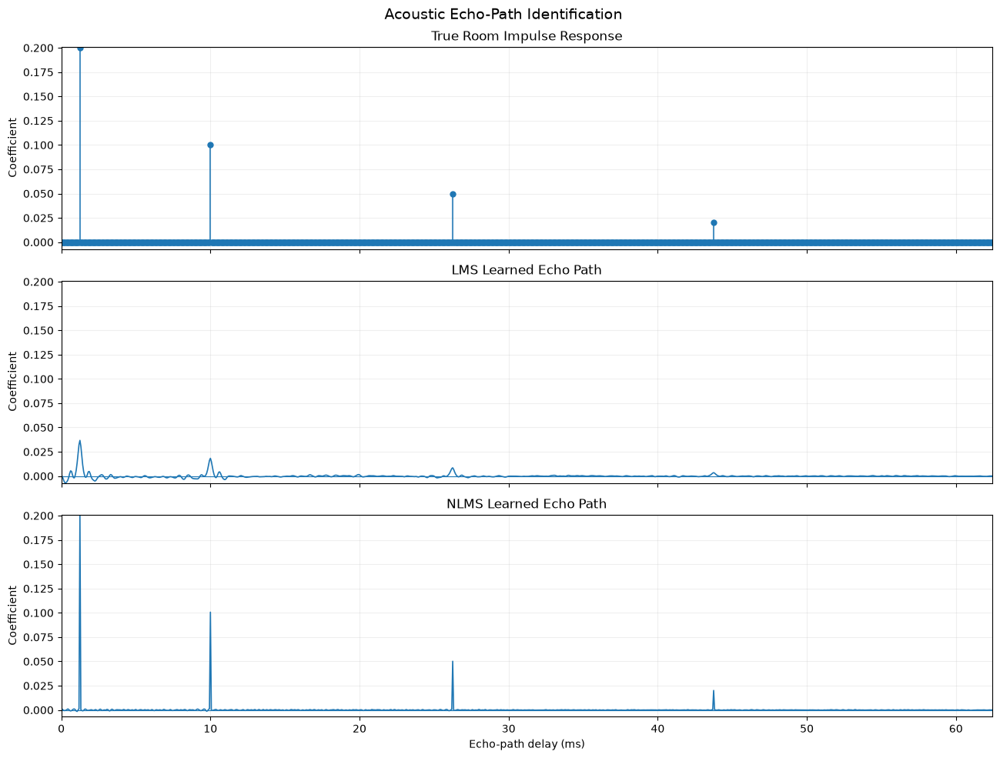
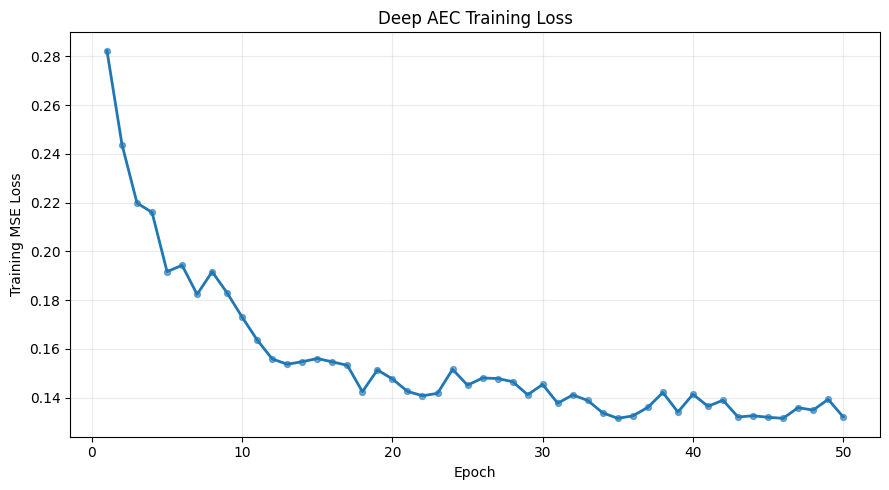
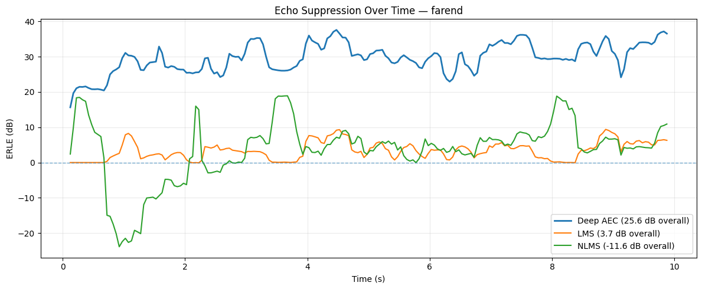
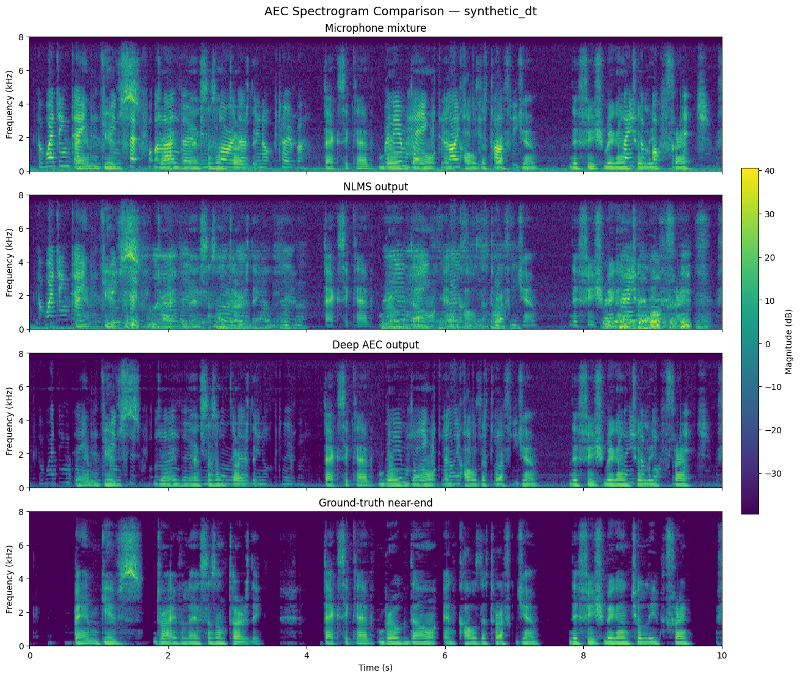

# Acoustic Echo Cancellation Benchmark
This project compares the performance of classical adaptive filters with a deep learning filter on the task of acoustic echo cancellation.
Specifically, we implement Least-Mean Squares (LMS), Normalized Least-Mean Squares (NLMS), and a recurrent neural network  based on the baseline architecture used in the [ICASSP 2023](https://www.researchgate.net/publication/366205532_ICASSP_2023_ACOUSTIC_ECHO_CANCELLATION_CHALLENGE) challenge. 

[comment]: <> ([ ***TODO: RESULTS AT A GLANCE HERE*** ]:)

## Problem definition 
Acoustic Echo Cancellation (AEC) uses signal processing algorithms to counteract unwanted delayed repetitions of sound. It's commonly applied to voice calls, wherein an audio speaker on a device may inadvertently leak audio back into the device's microphone. 

Formally, the microphone signal as observed by the AEC system is 
$$d[n] = h[n] * x[n] + s[n] + v[n]$$
where $h[n]$ is the acoustic echo path's Room Impulse Response (RIR), $x[n]$ is the unreverberated far-end speech, $s[n]$ is near-end speech, and $v[n]$ is noise.
AEC aims to preserve or restore near-end speech while suppressing far-end acoustic echo.

In **far-end singletalk** scenarios, no near-end speech is present, and the AEC method should simply suppress the microphone signal. In **double-talk** scenarios, near-end speech is present and should be preserved.

https://github.com/user-attachments/assets/f9233aa0-66b6-4f41-8ac6-a477da4b71b7

*An AEC infers echo-cancellation sequentially and on the go.*

## Classical Adaptive Filters

**Least-Mean Squares (LMS):**
LMS models the acoustic echo path as an adaptive Finite Impulse Response (FIR) filter with $M$ coefficients. At each timestep, the filter takes the most recent $M$ samples of the far-end reference signal,
$$\mathbf{x}_n = [x[n], x[n-1], \ldots, x[n-M+1]]^T$$
and produces an estimate of the echo

$$\hat y [n] = \mathbf{w}_n^T \mathbf{x}_n$$

The prediction error then becomes 
$$e[n] = d[n] - \hat y[n]$$
where $d[n]$ is the observed microphone signal.

LMS uses Mean Squared Error (MSE) to update its weights:
$$\mathbf{w}_{n+1}=\mathbf{w} + \mu e[n] \mathbf{x}_n$$

In AEC, $\mathbf{w}$ attempts to estimate the unknown RIR, while $\hat y$ estimates the far-end echo present in the signal. Since $e[n]$ represents the observed microphone speech subtracted by the model's prediction, it is also the echo-suppressed output.

**Normalized Least-Mean Squares (NLMS):** 
NLMS modifies the LMS update by normalizing step size $\mu$ by the energy of the current input vector:

$$\mathbf{w}_{n+1}=\mathbf{w}_n + \frac{\mu} {\epsilon + \|\mathbf{x}_n\|_2^2} e[n]\mathbf{x}_n$$

where $\epsilon$ is a small positive constant used to avoid numerical instability when the input energy is close to zero.

### Adaptive Filter Validation

Before evaluating LMS and NLMS on the real AEC dataset, we validated both implementations on a controlled echo-path identification task. A synthetic far-end signal was convolved with a known sparse room impulse response, and each adaptive filter was tasked with recovering the corresponding FIR coefficients.

The figure below compares the true echo path with the coefficients learned by LMS and NLMS. Both filters identify the locations of the dominant reflections, with NLMS recovering the impulse response more accurately in this controlled setting.

*Echo-path identification sanity check. The known synthetic room impulse response is shown above, followed by the echo paths estimated by LMS and NLMS.*

## Deep Learning AEC
We adapt an architecture based on the baseline noise suppression model in the [ICASSP 2023 Challenge Paper](https://www.researchgate.net/publication/366205532_ICASSP_2023_ACOUSTIC_ECHO_CANCELLATION_CHALLENGE). A recurrent neural network with two Gated Recurrent Unit (GRU) layers takes a log power scaled concatenation of spectral features of the far-end signal, and that of a summation of the near-end and far-end signals as input. We parameterize the short-time Fourier transforms (STFTs) with a 20 ms frame size and a hop size of 10 ms, making it a 320-point Fourier transform with a hop length of 160. The two recurrent layers are followed by a linear layer, which predicts a spectral mask as output. A sigmoid activation constrains the mask to $[0,1]$, after which it is multiplied point-wise with the microphone magnitude spectrogram to suppress far-end echo while preserving near-end speech.  We obtain our loss by evaluating the MSE between the magnitude-spectrograms of the predicted and near-end microphone signals. We use the Adam optimizer with a learning rate of 0.002 to train our model.

**Echo gain during training:** To expose the model to varying echo strengths, we randomly scale the far-end microphone signal before mixing:

$$d[n] = g \cdot x_{\text{echo}}[n] + s[n]$$

where $g$ is a randomly sampled gain. This prevents the model from overfitting to a fixed echo-to-speech ratio and improves robustness across different echo levels.

## Dataset
The experiments are evaluated on the real-world segment of the [ICASSP 2023 Challenge Dataset](https://www.researchgate.net/publication/366205532_ICASSP_2023_ACOUSTIC_ECHO_CANCELLATION_CHALLENGE), using an 80/20 train-test split. To avoid data leakage over different modes (near-end single, doubletalk, etc.) we deliberately sample our split based on a recording's GUID. To enable batch learning, we guarantee each processed sample to be the same length by randomly cropping a four-second segment out, and padding with zeros on audio samples with shorter durations. In order to give LMS and NLMS more time to converge, we extend this cropping to ten seconds during inference.

## Experiment setup
Based on the AEC scenario (singletalk, doubletalk) we evaluate the following metrics:

**Mean-Squared Error:** We evaluate MSE on both singletalk and doubletalk scenarios.

**Echo Return Loss Enhancement (ERLE):** Measures how well an adaptive filter reduces the echo signal. Formally:
$$ERLE = 10 \log_{10} \left( \frac{P_{mic}}{P_{enhanced}}\right)$$
where $P$ is linear signal power. Because this metric only cleanly maps on to signals that contain just echo, we only measure this on singletalk far-end scenarios.

### Adaptive Filter Baselines

LMS and NLMS were evaluated using the same held-out dataset as the neural AEC model.

For NLMS, a small parameter sweep was performed over the adaptation rate and filter length. The purpose of this sweep was to select reasonable baseline parameters rather than to optimize extensively for the test set.

#### Learning-rate sweep

| Learning rate | Mean ERLE (dB) | Median ERLE (dB) | Std. ERLE (dB) |
|---:|---:|---:|---:|
| 0.010 | 0.79 | 0.52 | 1.94 |
| 0.025 | 1.38 | 0.89 | 2.63 |
| 0.050 | 1.87 | 1.28 | 3.33 |
| 0.100 | 2.36 | 1.90 | 4.13 |
| 0.250 | 3.02 | 2.57 | 5.11 |
| 0.500 | 3.41 | 3.34 | 5.86 |
| 1.000 | 3.21 | 3.91 | 6.45 |

#### Filter-length sweep

| Filter length | Duration (ms) | Mean ERLE (dB) | Median ERLE (dB) | Std. ERLE (dB) |
|---:|---:|---:|---:|---:|
| 500 | 31.25 | 1.72 | 1.91 | 4.18 |
| 1000 | 62.50 | 2.38 | 2.21 | 5.01 |
| 1280 | 80.00 | 2.63 | 3.39 | 4.98 |
| 1600 | 100.00 | 2.65 | 3.52 | 4.93 |
| 2000 | 125.00 | 2.64 | 3.61 | 4.89 |
| 3000 | 187.50 | 2.81 | 3.21 | 4.41 |

Based on these results, the final NLMS configuration used:

- learning rate: `0.5`
- filter length: `1350` taps
<!-- Verify final NLMS filter length: 1350 taps is not one of the sweep values shown above. -->

### Deep AEC model parameters
We train our Deep AEC model with the following configuration:

- learning rate: `0.002`
- batch size: `64`
- epochs: `50`
- dft window length: `320`
- hop length: `160`
- GRU hidden dimensionality: `322`
- train fraction: `0.8`

## Results

The table below summarizes the final evaluation results for the Deep AEC model and the classical LMS/NLMS baselines.

<table>
  <thead>
    <tr>
      <th rowspan="2">Scenario</th>
      <th colspan="2">Deep AEC</th>
      <th colspan="2">LMS</th>
      <th colspan="2">NLMS</th>
    </tr>
    <tr>
      <th>ERLE (dB)</th>
      <th>MSE</th>
      <th>ERLE (dB)</th>
      <th>MSE</th>
      <th>ERLE (dB)</th>
      <th>MSE</th>
    </tr>
  </thead>
  <tbody>
    <tr>
      <td>Far-end single talk</td>
      <td><b>25.09</b></td>
      <td>0.0467</td>
      <td>4.15</td>
      <td>0.38</td>
      <td>3.79</td>
      <td>1.63</td>
    </tr>
    <tr>
      <td>Far-end + movement</td>
      <td><b>22.40</b></td>
      <td>0.0552</td>
      <td>2.56</td>
      <td>1.13</td>
      <td>-0.02</td>
      <td>4.11</td>
    </tr>
    <tr>
      <td>Near-end single talk</td>
      <td>—</td>
      <td>0.000035</td>
      <td>—</td>
      <td><b>0</b></td>
      <td>—</td>
      <td><b>0</b></td>
    </tr>
    <tr>
      <td>Synthetic double-talk</td>
      <td>—</td>
      <td><b>0.3078</b></td>
      <td>—</td>
      <td>1.78</td>
      <td>—</td>
      <td>34.70</td>
    </tr>
    <tr>
      <td>Synthetic double-talk + movement</td>
      <td>—</td>
      <td><b>0.3553</b></td>
      <td>—</td>
      <td>3.26</td>
      <td>—</td>
      <td>37.37</td>
    </tr>
    <tr>
      <td>Overall</td>
      <td><b>23.74</b></td>
      <td><b>0.15</b></td>
      <td>3.36</td>
      <td>1.31</td>
      <td>1.88</td>
      <td>15.56</td>
    </tr>
  </tbody>
</table>

### Training convergence

The Deep AEC models' training loss consistently trends downwards over the full 50 epoch training trajectory, indicating that the model successfully learned to predict spectral masks that more closely reconstruct the near-end target magnitude spectrum.

*Training MSE loss of the Deep AEC model over 50 epochs. The overall decrease in loss indicates progressive improvement in reconstructing the near-end magnitude spectrogram.*

## Discussion
Across the echo-containing scenarios, the Deep AEC model substantially outperforms the classical baselines on ERLE and MSE. In near-end single-talk, LMS and NLMS achieve zero MSE because the far-end reference is silent, while Deep AEC achieves a similarly low MSE of 0.000035

We also see that the classical models struggle to keep up with more complex tasks, such as echo reduction when movement is present, or doubletalk scenarios. For movement, this makes sense, given that the classical models work by learning the RIR as their filter. The performance of our Deep AEC model degrades less on movement tasks, showing itself to be relatively more adaptive to more complex scenarios.

The image below highlights an inherent disadvantage during inference of the classical AEC models; they need an arbitrary number of samples to adjust their filter to the signal's acoustic RIR. Particularly for NLMS, we observe it failing to perform in line with the other models for the first two seconds, after which its performance falls in line with LMS. 
In contrast, the Deep AEC model is advantaged in that it has been extensively trained prior to inference, while its GRU state still makes it capable of adjusting during runtime.

*The classical models require time to adapt their filter to the signal's acoustic RIR.*

The image below shows spectrograms produced with each model's output, and the ground-truth, respectively. In line with the results, the Deep AEC output more closely resembles the ground truth than the classical methods. 

